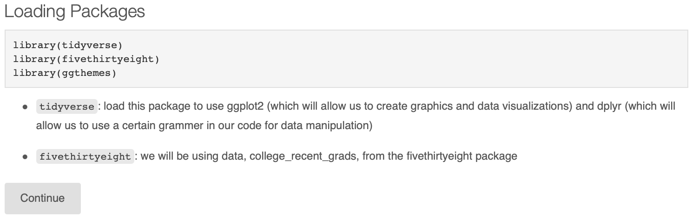
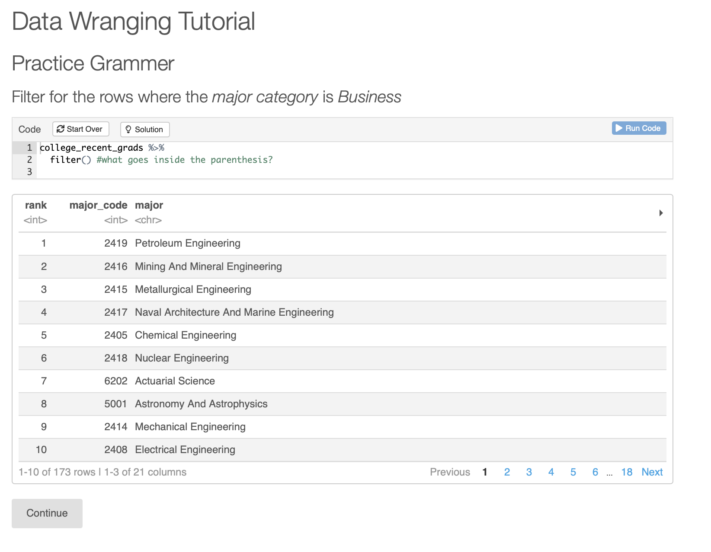
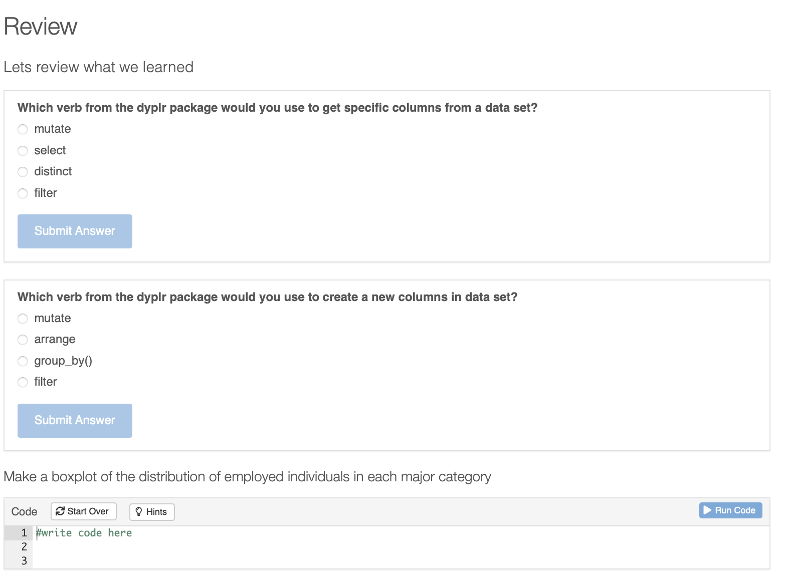

# Data Wrangling in R Tutorial

Repository for my Data Wrangling Tutorial project using R. For this project, I used the [`learnr`](https://rstudio.github.io/learnr/) package in r studio. The `learnr`package let me create an interactive tutorial through R Markdown!

  

## About This Tutorial
This tutorial goes through the different components of Data Wrangling using R. This tutorial goes through the process/pipeline of data wrangling as well as how to manipulate and organize data. The tutorial follows the process of data wrangling using the dataset `college_recent_grads` from the `fivethirtyeight` package in R. You can learn more about this data set in the story ["The Economic Guide To Picking A College Major"](https://fivethirtyeight.com/features/the-economic-guide-to-picking-a-college-major/).

To try the tutorial out for yourself, open up the [DataWranglingTutorial.Rmd](https://github.com/ismahahmed/Data-Wrangling-R-Tutorial/blob/master/DataWranglingTutorial.Rmd) file located in this repository. (Make sure you have installed all the correct packages inclusing learnr, tidyverse, fivethirtyeight and ggplot2). From here you can run the document and you will be able to open up and access the interactive tutorial!

## The Tutorial

The tutorial first starts with package installation/loading the packages we need to go through the data wrangling process using R. These packages include the `tidyverse` package (for the grammer in data wrangling), `fivethirtyeight` package (since we will be using one of their dataset) and `ggthemes` (for data visualization purposes). 

  

As you go through the tutorial and learn about the different concepts of data wrangling, you will come across practice questions. These excercies will help you implement what you are learning throughout the tutorial.

  

At the end of the tutorial, there is the final excercise which is the review. The review includes excercies that are relevent on what you learned overall in this tutorial.

  

